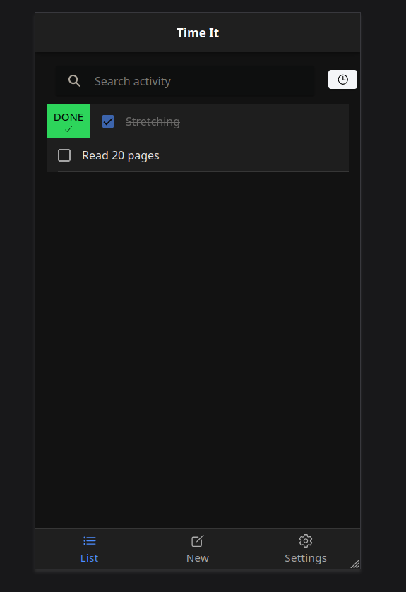
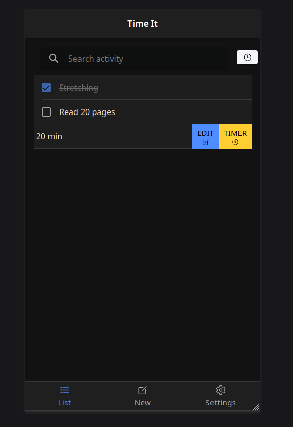
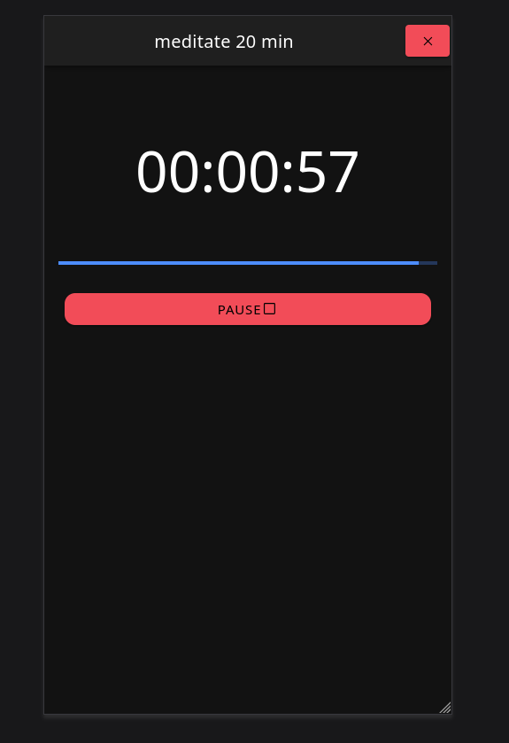

# Time It
> an application project of Mobile Programming (Master Degree in Computer Science at University of Padua)

**Authors**:
- Alberto Morini
- Marco Bellò

------------------------------

Open stuff:
- grafica/comfort zone
- schedule is kinda hard, do it or nah pace?

------------------------------
## Idea

## Technology 

- framework chosen (Ionic)
- Ionic Storage
- React

## Deployment

- to iOS and Android

## Screenshots

## Conclusion 

